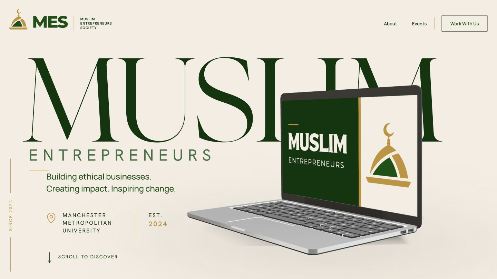

# MES Website

A live website for the **Muslim Entrepreneurs Society (MES)** at Manchester Metropolitan University, designed and developed by Ateeq Rehman. It combines editorial layouts, society content and real event photography with a scroll-driven, real-time 3D laptop that transitions into the page itself.

**[Visit the live website → mmumes.com](https://mmumes.com)** · Hosted on Vercel

## Preview

Actual production homepage, captured on 10 October 2026 with the interactive WebGL scene active.



<details>
<summary>Mobile homepage — 390 × 844 CSS pixels</summary>


</details>

The mobile preview uses an emulated viewport in desktop Chrome. See [capture details](docs/images/README.md).

## Overview

MES is an independent MMU student society established in 2024. It brings Muslim students together around entrepreneurship, professional development and community, connecting aspiring founders with businesses, speakers and organisations.

The website gives students and potential collaborators a central place to understand the society, explore its activities and get involved. The interactive homepage connects MES branding to photographs from its events, followed by its purpose, impact, featured experiences and network. Supporting pages present the society's history, team, collaboration opportunities and committee recruitment.

## Key Features

- **Interactive 3D hero:** a GLB laptop rendered in real time, with reversible scroll-driven camera movement and model rotation.
- **Dynamic screen content:** canvas-rendered branding, three event photographs and a purpose statement, with animated reveals and responsive crops.
- **WebGL-to-HTML transition:** the laptop display fills the viewport before matching HTML content takes over.
- **Responsive presentation:** separate desktop and portrait scene compositions, adaptive typography, editorial layouts and mobile navigation.
- **Motion and rendering alternatives:** reduced-motion behaviour keeps the opening scene static; a branded fallback preserves the page when WebGL is unavailable or fails.
- **Society content:** history, team profiles, impact statistics, featured event posters and a network of businesses, organisations and speakers.
- **Partnership and recruitment:** collaboration information, email contact, community links and a committee application dialog with an embedded Tally form and a direct-link alternative.

The `/events` route currently presents the 2026/27 programme announcement. Featured past experiences appear on the homepage; there is no event booking system or populated upcoming-events catalogue.

## Engineering Highlights

### Scene and asset integration

[HeroCanvas](src/components/hero/hero-canvas.tsx) separates scene composition, model preparation and WebGL lifecycle handling. Drei's `useGLTF` loads the prepared laptop asset; the scene is cloned and its named `MES_Display` mesh receives a `MeshBasicMaterial` backed by a generated `CanvasTexture`. The unlit display material keeps the artwork independent of scene lighting, while the chassis uses physical materials and environment lighting. Created materials and canvas textures are disposed of during cleanup.

### One scroll signal, two rendering systems

[StaticHero](src/components/hero/static-hero.tsx) measures progress through a sticky hero stage. Passive scroll events are coalesced with `requestAnimationFrame`, then written to a small [subscription-based signal](src/components/hero/hero-progress.ts). React Three Fiber reads that signal in `useFrame` to interpolate camera position, look-at targets and model transforms across defined progress segments. Scrolling backwards retraces the sequence without a separate animation timeline.

The same progress updates DOM styles for title, navigation and takeover opacity. [Shared artboard coordinates and handoff windows](src/components/hero/hero-purpose-layout.ts) align the canvas statement with its HTML counterpart, including projection adjustments for tablet proportions. The rest of the site remains semantic HTML.

### Canvas artwork and loading

[The display renderer](src/components/hero/hero-display-texture.ts) draws a 1246 × 720 logical artboard containing type, SVG branding and cropped photography. It uses the Font Loading API before rasterising text, retaining logo artwork while fonts load. Photographs load independently, and failed photographs retain branded artwork. The texture uses sRGB colour space, linear filtering and no mipmaps; progress thresholds avoid redrawing unchanged artwork.

The homepage preloads the approximately **480 KiB GLB**. The Three.js scene is dynamically imported with server-side rendering disabled, after a WebGL capability probe. A preview remains visible during loading; the loader handles scene errors and WebGL context loss through a static fallback.

### Responsive rendering and demand-driven frames

Portrait framing uses its own camera path and display anchor, rather than scaling the desktop composition. Mobile quality settings cap framebuffer pixel ratio at **1.35**, disable real-time shadow maps and use a generated radial shadow texture. Display texture backing resolution is controlled separately from framebuffer resolution to retain readable screen artwork.

The R3F canvas uses `frameloop="demand"`: progress subscriptions, asset readiness and resizing invalidate the scene when another frame is needed. The environment is captured once with `frames={1}`. These are implementation strategies; they do not establish a measured frame-rate or battery-life improvement.

## Tech Stack

Versions below are resolved in the committed [package lockfile](package-lock.json).

| Technology | Version | Role |
| --- | --- | --- |
| Next.js | 16.3.8 | App Router, prerendered pages, metadata, images and fonts |
| React / React DOM | 19.2.8 | Component composition and browser interactions |
| TypeScript | 5.9.3 | Strict typing, typed content and route links |
| Tailwind CSS | 4.3.3 | Utilities and CSS layers alongside custom styles |
| Three.js | 0.182.0 | WebGL rendering, materials and textures |
| React Three Fiber | 9.7.0 | React scene composition and render lifecycle |
| React Three Drei | 10.7.8 | GLB loading, camera and environment helpers |
| Vercel | Managed platform | Production hosting and Next.js image optimisation |

Typography uses Apparel Display, TAN Headline, Hanken Grotesk, Newsreader, Manrope and Montserrat. The first two require authorised private webfont assets.

## Architecture

The **Next.js App Router** organises the five public routes. Route components and the root layout provide server-rendered content, page metadata and the shared header/footer. Client Components handle scroll effects, navigation dialogs, recruitment and the isolated 3D hero. All five pages are statically prerendered by the production build.

Components are grouped into `hero/`, `layout/` and `sections/`. Typed repository data in `src/data/` holds photographs, statistics, team members, journey milestones, featured experiences and network entries separately from presentation. `src/lib/metadata.ts` provides common metadata, with dedicated sitemap and robots routes.

Runtime images, logos and the GLB live in `public/`; source photography and Blender assets live in `assets-source/`. CSS tokens and section styles live in `src/styles/`, with CSS Modules for selected components. Fonts are self-hosted through `next/font`, with licensed files prepared privately before compilation.

There is no application backend, database or CMS. Committee applications are handled by Tally; its iframe mounts only when the dialog opens. Enquiries use email links.

## Pages

| Route | Purpose |
| --- | --- |
| [`/`](https://mmumes.com) | 3D homepage, purpose, impact, featured experiences and network |
| [`/about`](https://mmumes.com/about) | Society history, activities, team and MMU context |
| [`/events`](https://mmumes.com/events) | Published announcement for the forthcoming 2026/27 programme |
| [`/work-with-us`](https://mmumes.com/work-with-us) | Collaboration opportunities and committee applications |
| [`/privacy`](https://mmumes.com/privacy) | Privacy notice covering hosting, enquiries and recruitment; laptop asset credit |

## Performance and Accessibility

The **October 2026 initial-load Lighthouse results** were:

| Test profile | Performance | Accessibility | Best Practices | SEO |
| --- | --- | --- | --- | --- |
| Mobile | 92 | 96 | 100 | 100 |
| Desktop | 98 | 100 | 100 | 100 |

**Testing condition:** these runs displayed the static WebGL fallback, not the active 3D scene. They assess initial loading under that condition and do not demonstrate the performance of the complete interactive experience. The 3D animation has separately been investigated on desktop and under emulated mobile conditions; verified real-phone performance is not established here.

The site targets **WCAG 2.2 AA**, without claiming certification. Implemented provisions include a skip link, semantic landmarks and headings, visible focus styles, image alternatives, keyboard navigation and native dialogs with focus management. Decorative WebGL content is hidden from assistive technology, with society information and photograph descriptions available in HTML. `prefers-reduced-motion` removes the long hero scroll sequence and adjusts section and navigation motion. WebGL failure shortens the hero and keeps the purpose statement and page content accessible.

Local WebP assets and Next.js image optimisation support the content pages. Lighthouse accessibility scores are automated checks, not a substitute for a full accessibility assessment.

## Local Development

Use **Node.js 22.x**, npm and GitHub CLI for the normal local authentication path.

**Private assets are required:** a clean public clone cannot run or build the complete site without authorised access to the purchased Apparel Display and TAN Headline WOFF2 files. Do not substitute or redistribute them.

```bash
git clone https://github.com/ateeqrehman360/MES-Website.git
cd MES-Website
npm ci

# Authenticate with an account authorised to read MES-Private-Assets.
gh auth login
npm run fonts:prepare

npm run dev
```

Open [localhost:3000](http://localhost:3000). Validate with:

```bash
npm run lint
npm run typecheck
npm run test:fonts
npm run build
```

`predev` and `prebuild` validate or retrieve fonts into a gitignored directory. Use the npm scripts so those hooks run. Google font families are downloaded at build time and self-hosted in the output, so a fresh build also needs access to Google's font endpoints.

See [Private Webfonts and Builds](docs/PRIVATE_FONTS_AND_BUILDS.md) for `MES_PRIVATE_ASSETS_TOKEN`, read-only authentication, cache recovery, Vercel configuration, token rotation and outstanding licensing obligations. Never commit credentials or purchased font binaries.

## Project Structure

```text
MES-Website/
├── assets-source/          # Source photography, branding and 3D working assets
├── docs/                   # Operations, licensing and project documentation
├── public/                 # Runtime brand, hero, events, network and model assets
├── scripts/                # Private-font preparation and regression checks
├── src/
│   ├── app/                # Public routes, root layout, sitemap and robots
│   ├── assets/fonts/       # Montserrat notice/file and ignored private-font cache
│   ├── components/
│   │   ├── hero/           # Scroll signal, scene, textures and HTML handoff
│   │   ├── layout/         # Header, mobile navigation and footer
│   │   └── sections/       # Page sections and their motion components
│   ├── data/               # Typed content and site configuration
│   ├── lib/                # Metadata helpers
│   └── styles/             # Tokens, base and section styles
└── package.json
```

## Documentation

- [Documentation index](docs/README.md) — current guidance and historical planning records.
- [Private Webfonts and Builds](docs/PRIVATE_FONTS_AND_BUILDS.md) — authorised setup and build operations.
- [Asset Licensing](docs/ASSET_LICENSING.md) — laptop attribution, asset boundaries and unresolved obligations.
- [Privacy Compliance Checklist](docs/PRIVACY_COMPLIANCE_CHECKLIST.md) — privacy operations and owner review items.

## Credits and Licensing

The laptop originates from **[“Laptop” by Aullwen](https://skfb.ly/6RVFt)** on Sketchfab, licensed under **[Creative Commons Attribution 4.0](https://creativecommons.org/licenses/by/4.0/)**. The MES implementation uses a prepared GLB with custom screen artwork, photography and material treatment. A source and licence credit also appears on the live privacy page.

Third-party models, licensed fonts, MES photography, branding and partner logos have separate rights. No repository-wide software licence is currently declared. Font purchase-specific terms, TAN canvas use and removal of earlier font files from public Git history remain owner review items. See [Asset Licensing](docs/ASSET_LICENSING.md); this README does not certify that all licensing obligations have been completed.

## Author

**[Ateeq Rehman](https://github.com/ateeqrehman360)**<br>
BSc Software Engineering<br>
Manchester Metropolitan University
